[[Table of Contents](Index.md#tblcontents)]

# Chapter 1

### Setup & Installation

Before you start to make an MIT App Inventor project, you'll need to check, if your computer that you are using is valid for the system requirements, kindly check down below if it's valid you can proceed for [creating a project](#h3cnp), though if it's not kindly contact me at this gmail **kevinmagnifico77@gmail.com** to giving you a technical advice.

* **System Requirements**
  
  > **Computer Device** :
  > 
  > * Desktop
  > * Laptop
  > * Mac Book
  
  > **Operating System support** (for project creation) : 
  > 
  > * GNU/Linux
  >   
  >   * Debian 5 or higher
  >   * Ubuntu 8 or higher
  >   * Linux Mint 7 or higher
  > 
  > * Microsoft Windows -
  >   
  >   * XP
  >   * 7
  >   * 8 or 8.1
  >   * 10
  >   * 11
  > 
  > * Mac OS X
  >   
  >   * 10.5 or higher
  
  > **Operating System support** (for app debugging) :
  > 
  > * Android
  >   
  >   * 2.1 or higher
  > 
  > * iOS
  >   
  >   * 9.0 or higher
  
  > **Web browser** :
  > 
  > * Google Chrome - (Latest version)
  > 
  > * Brave - (Recommended and Latest version)
  > 
  > * Mozilla Firefox - (Latest version)
  >   
  >   **Note** : According to MIT App Inventor, Internet Explorer is not supported, They said Google Chrome or Firefox is recommended.
  
  > **Google Account (required)**

  > **Internet Connection (required)**

For more information you could visit in this website ([MIT App Inventor - System Requirements](https://appinventor.mit.edu/explore/content/system-requirements)).

  ---

### Create a new Project

Now let's start making a project, first you'll need to open up your web browser and then visit this website [https://appinventor.mit.edu/](https://appinventor.mit.edu/).

Once you visited the MIT App inventor website, kindly follow this steps down below.

* **Step [0]**

  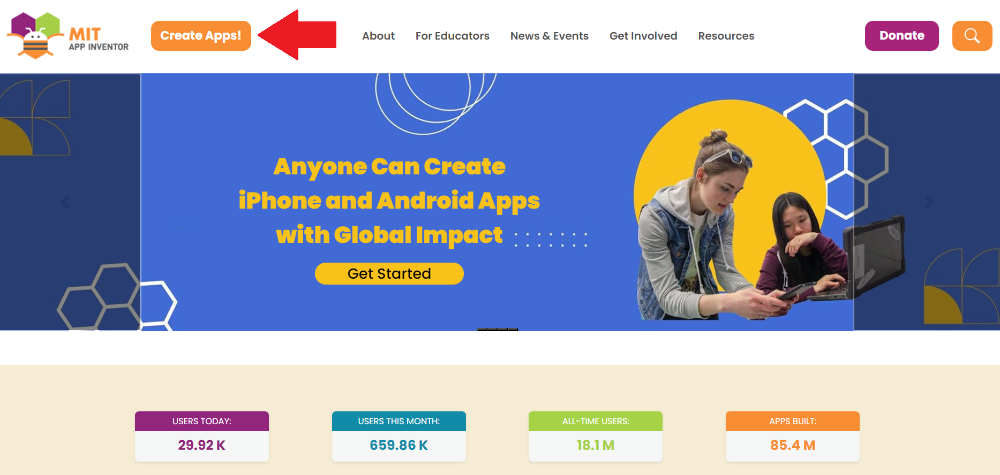
  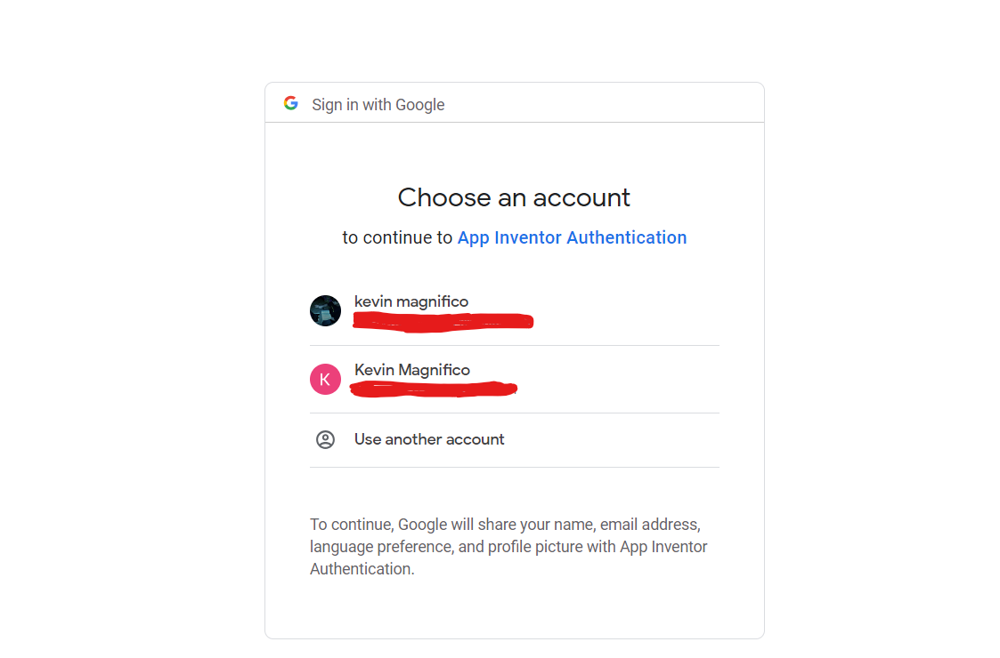
  > Click the "**Create Apps**" button and then once the google sign-in show up, you must login or choose an account with it. 

* **Step [1]**

  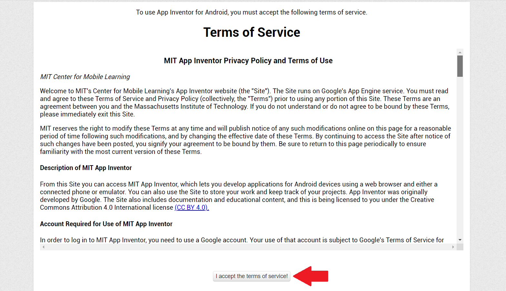
  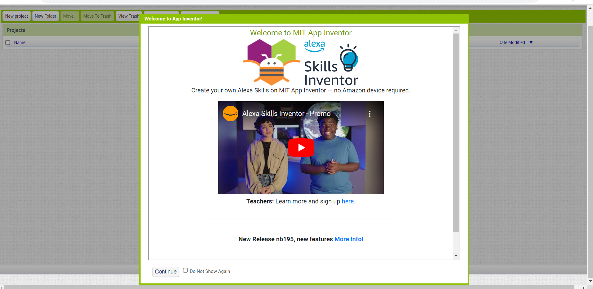
  > and then you'll see the **Terms of Services**, after that if you like to read it to make sure you are informative or else you could skip it by pressing the "**I accept the terms of service!**" button and see what happen you navigated the **IDE**, and you could finally starting to create your project.

* **Step [2]**

  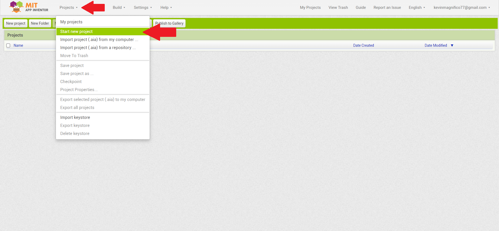
  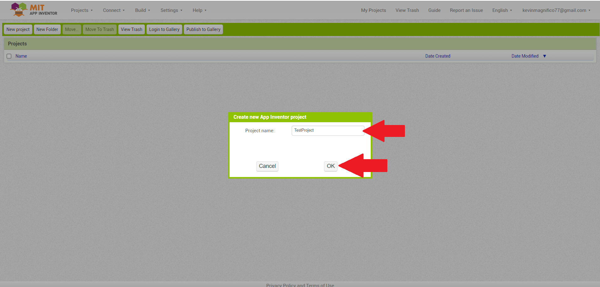
  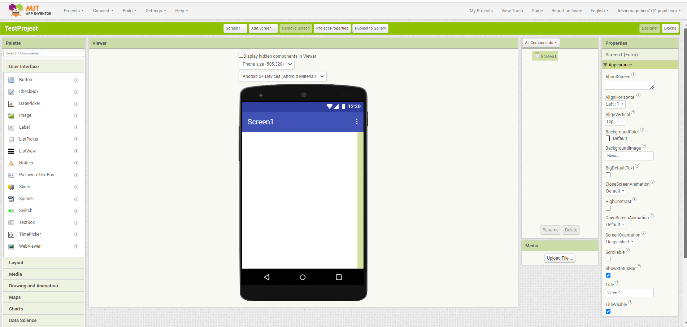

  > Find the "**Projects Menu**" : That besides at the right part of "**MIT App Inventor - logo**", now click it and then click the "**Start new project**" submenu. As you can see when the dialog show up, you must enter your project name (For me i name it "**TestProject**") and then press the "**OK**" button.
  > 
  > After you pressed the "**OK**" button, you'll see from the [third image](#Step2-2-img) and same as you follow the steps, you are now inside into your project and what you see is, you are now into the "**Designer**" part, that you could actually design your app whatever you like.
  > 
  > #### Take Note : 
  > 
  > * **Note [0]** : You could cancel with it, by pressing the "**Cancel**" button if you don't want it.
  > 
  > * **Note [1]** : To close the project and if you want to go back from the ["**Project list**"](assets//Common//Project-List.png) click the ["**My Projects**"](assets//Common//My-Projects-menu.png) menu at the top right part.
  > 
  > * **Note [2]** : To save a project you'll need to click the "**Projects**" menu and then click the "**Save project**" submenu, If you don't get it this is the image([Save Project Image](assets//Common//Save-projects.png)).

---

### Explore the MIT App Inventor Interface

In "**MIT App Inventor Interface**" has a divided by parts and you'll see the [Pallete Panel](assets//Common//Pallete-Panel.png), [Designer Viewer](assets//Common//Designer-Viewer.png), [Components Panel](assets//Common//Components-Panel.png), [Media Panel](assets//Common//Media-Panel.png), [Properties Panel](assets//Common//Properties-Panel.png), [Menu](assets//Common//Menu.png), [Blocks Panel](assets//Common//Blocks-Panel.png), [Blocks Viewer](assets//Common//Blocks-Viewer.png), [Trash](assets//Common//Trash.png), [Designer and Blocks Button](assets/Common//Designer-and-Blocks-Button.png), and etc.

So we need to discuss individually all of this interface that i mentioned earlier. Ok lets start.

* **Pallete Panel**

  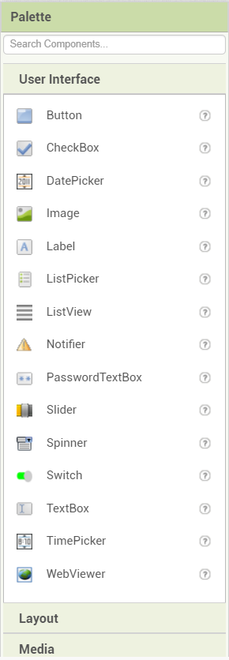

  > The Pallete Panel is a collection of components and it was divided in a "**14 Categories**", see at the below.
    * **User Interface**
    * **Layout**
    * **Media**
    * **Drawing and Animation**
    * **Maps**
    * **Charts**
    * **Data Science**
    * **Sensors**
    * **Social**
    * **Storage**
    * **Connectivity**
    * **LEGO® MINDSTORMS®**
    * **Experimental**
    * **Extension**
  > 
  > 
  > I know it's too many, but.. it doesn't mean you'll need to apply all of these things into your project, but anyway... each of these categories has a bunch of components for example : in **User Interface** they have Button, Label, TextBox, and etc. as you can see, they have it's own functionality and purposes.
  > 
  > #### Take Note :
  > 
  > * **Note [0]** : The **Pallete Panel** is located from the left side and near at the **Designer Viewer**.

* **Designer Viewer**

  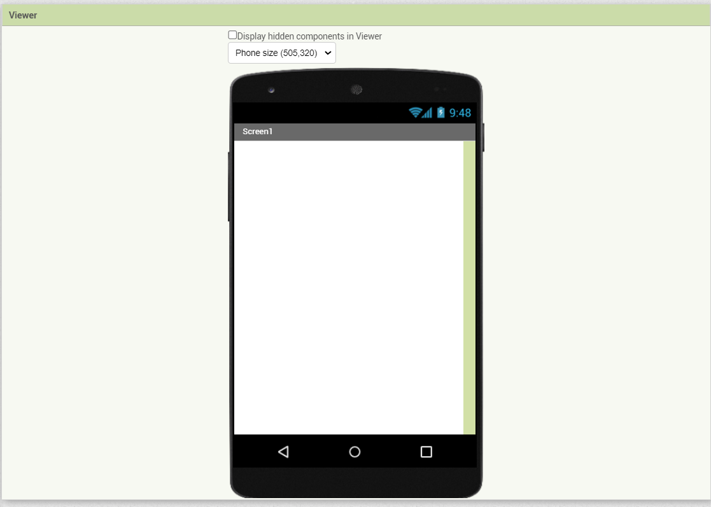

  > The purpose of this "**Designer Viewer**" is to make a structural design or layout for your app and to see what it looks like.
  > 
  > #### Take Note :
  > 
  > * **Note [0]** : The **Designer Viewer** is located from the middle.
  > * **Note [1]** : In **Layout** you could arrange the UI's via veritically, horizontally, or Table in it.
  > * **Note [2]** : The (**Ctrl + C**) and (**Ctrl + V**) - (known as **Copy** and **Paste**), is working if you want to duplicate some components on it.
  > * **Note [3]** : The last thing is some components is invisible when you attached it on the **Designer Viewer** because that component was a feature not UI's.

* **Components Panel**

  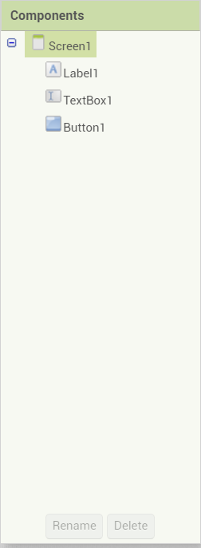

  > The "**Components Panel**" is a sort of components that your putting in, that came from the "**Pallete Panel**" and you'll see all components that you attached from the "**Designer Viewer**" it will show up on the Components Panel and the other thing is, you could "***rename***" or "***delete***" the components from it.
  > 
  > #### Take Note :
  > 
  > * **Note [0]** : The **Components Panel** is located from the right side and near at the **Designer Viewer**.

* **Media Panel**

  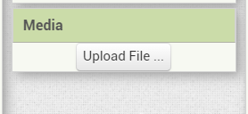

  > This "**Media Panel**" is a local asset for your app and those are image, video, sound, text file, and etc...
  > 
  > #### Take Note :
  > 
  > * **Note [0]** : The **Media Panel** is located from the bottom part of the **Components Panel**.

* **Properties Panel**

  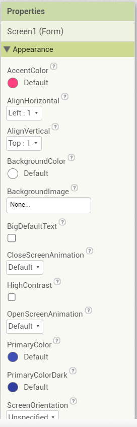

  > The uses of the "**Properties Panel**" is to change the appearance and behaviors of the components that you set in.
  > 
  > #### Take Note :
  > 
  > * **Note [0]** : The **Properties Panel** is located from right side corner and it was near at **Components Panel**.
  > * **Note [1]** : Each component properties can be manipulated by using code blocks, although watch out... not all properties can possibly intereact with code blocks.

* **Menu**

  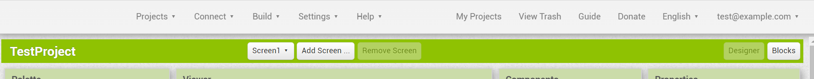

  > The "**Menu Panel**" is basically, this is where your project can be manipulated by opening, saving, building, debugging, guides, and other things stuff like that,
  > 
  > #### Take Note :
  > 
  > * **Note [0]** : You can actually build an ***.apk** file for your android phone.
  > * **Note [1]** : If you want to test your app, go to **Connect** menu > **AI Companion** submenu and then click, this will generate a QR code to scan it by using [MIT AI2 Companion](https://play.google.com/store/apps/details?id=edu.mit.appinventor.aicompanion3&hl=en&gl=US).

* **Blocks Panel**

  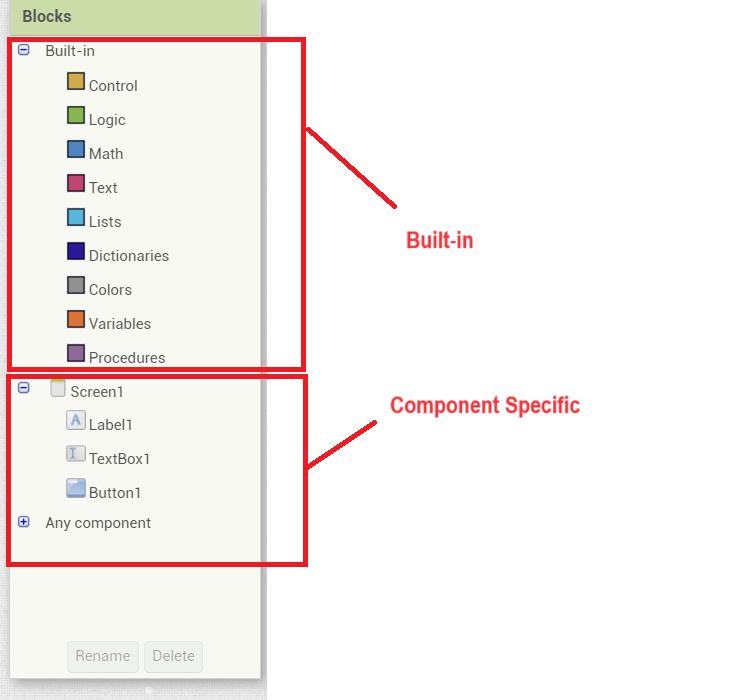

  > The "**Blocks Panel**" is a sort of collections of "**Built-in**" and "**Component Specific**" drawers blocks, that can be used on your app logic, and then each categories of **Built-in** and **Component specific** drawers... they have a bunch of blocks and each of those blocks has it's own functionality.
  > 
  > In **Built-in** blocks they have **9 Categories** available and each of those can be apply on the components, and the second one... **Component Specific** block is connected to the **Components Panel**, because all sort of things that you attached on [Designer Viewer](assets//Common//Designer-Viewer.png) it will be visible from this section.
  > 
  > #### Take Note :
  > 
  > * **Note [0]** : You'll see from the **Components Specific**, they have **get** and **set**, and the meaning of these... **get** is when you get a value and **set** is when you set a value.
  > * **Note [1]** : You can actually apply a **get** value from the **variable**.
  > * **Note [2]** : You don't want to attach all the blocks from your app, because all you need to do is attach a block that you needed for.

* **Blocks Viewer**

  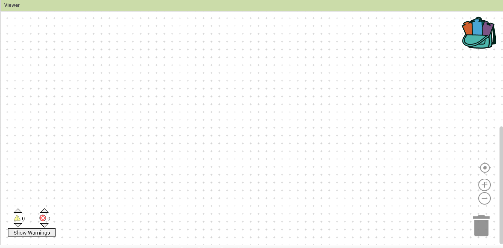

  > **Blocks Viewer** is your editor for the blocks that your putting in and this is where you make a logic for your app.
  >
  > #### Take Note :
  > 
  > * **Note [0]** : Much better to arrange the blocks properly, because it is hard to read or to maintain if the blocks are very messy.
  > * **Note [1]** : It's much better to add a comments on the blocks, to easy to know what it is ([This is how to add comment on you block](assets//Common//Add-Comment.png)).

* **Trash**

  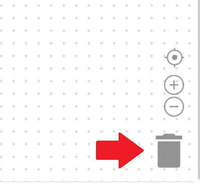

  > Inside of **Blocks Viewer**, there is a "**Trash**" that you can actually delete the blocks that you don't needed.
  > 
  > #### Take Note :
  > 
  > * **Note [0]** : Before you delete the blocks, make sure you don't need it

* **Designer and Blocks Button**

  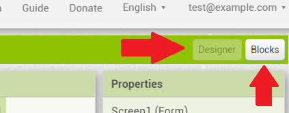

  > The "**Designer and Blocks Button**" is an interface that you could actually switch between **Designer Viewer** and **Blocks Viewer**.

---

### Run it & Debugging

There are many ways to run & debug the apps that you created. first you could use the **MIT AI2 Companion**, **Emulator**, or via **USB Connection**, although the most common use is using an "**MIT AI2 Companion**" and this can be downloaded at **Play Store (For Android OS)** or **App Store (For iOS OS)**.

  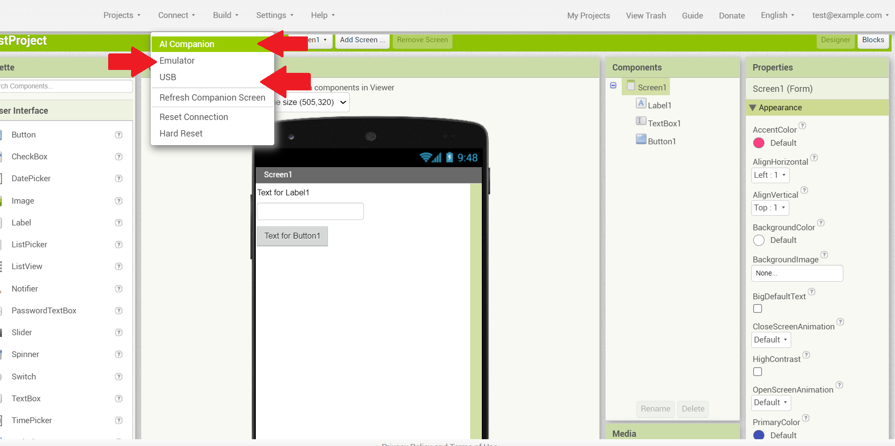

  > Click the **Connect** menu and see about that.
  >
  > * **AI Companion**
  > * **Emulator**
  > * **USB**
  > 
  > #### Take Note : 
  > 
  > * **Note [0]** : If there's any circumstances on your debugging just click the "**Connect**" menu and then find & click the "**Reset Connection**" submenu.
  > * **Note [1]** : If you having modify on **Blocks Viewer** and you try to test with your app, Please click the "**Refresh Companion Screen**", to refresh all the changes.

---

[[Previous](Chapter-0.md)]&nbsp;&nbsp;[[Next](Chapter-2.md)]&nbsp;&nbsp;[[Table of Contents](Index.md#tblcontents)]

###### **Author & Copyright (c)** : Kevin C. Magnifico

###### **License** : MIT Expat license

###### **Initial created** : 2023-12-27

###### **File Format** : Markdown (*.md)
