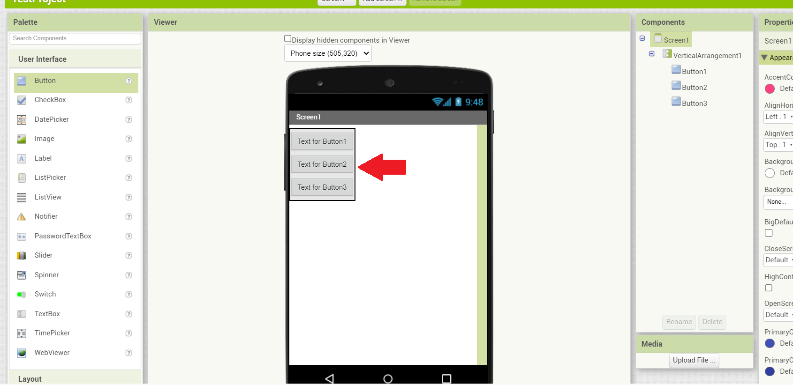
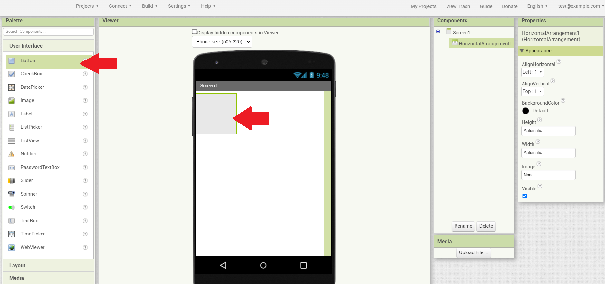

[[Table of Contents](Index.md#tblcontents)]

# Chapter 2

### Basic Layout

One of the main reason, why should need to learn about basic layout, is because we need to understand the proper layout for the best of **User Experience** (known as **UX**) and giving some better alignment of your **User Interfaces**.

In **MIT App Inventor** they have 5 types of Layout components.

  * Vertical Arrangement
  * Horizontal Arrangement
  * Vertical Scroll Arrangement
  * Horizontal Scroll Arrangement
  * Table Arrangement

---

### Vertical Arrangement

The uses of **Vertical Arrangement** is to align all the **User Interfaces** vertically.

* **Step [0]**

    

    > Navigate the [Pallete Panel](assets//Common//Pallete-Panel.png) and click the **Layout** tab.

    

    > Then once you click the **Layout** tab, find the **Vertical Arrangement** component.

    
    
    > and when you find it, drag it and drop it... at the [Designer Viewer](assets//Common//Designer-Viewer.png).

* **Step [1]**

    

    > Next... navigate the [Pallete Panel](assets//Common//Pallete-Panel.png) again and click the **User Interface** tab.

    
    

    > Find the **Button** component drag it and drop it inside of **Vertical Arrangement** (Actually... i put a 3 buttons inside on it), and see what happen, all buttons that i put in... was align vertically.
    > 
    > #### Take Note :
    > 
    > * **Note [0]** : Not just a button user interface could be align vertically, although the other user interfaces too... like (Label, Checkbox, Switch, Textbox, etc...).
    >
    > * **Note [1]** : If you change the width of **Vertical Arrangement** as **Fill Parent**, it would be fit onto your screen width [(see the image)](assets//Common//Fill-parent.png).
    >
    > * **Note [2]** : You can add background color in **Vertical Arrangement**.
    >
    > * **Note [3]** : You can put all the widgets from the center horizontally, by change it the **AlignHorizontal** property from **Left** to **Center**  [(see the image)](assets//Common//AlignHorizontal-Center.png).

---

### Horizontal Arrangement

The purpose of using **Horizontal Arrangement** is to align all the **User Interface** horizontally, same as on **Vertical Arrangement**, although in the opposite direction.

* **Step [0]**

    
    
    

    > Go to [Pallete Panel](assets//Common//Pallete-Panel.png) click the **Layout** tab, find the **Horizontal Arrangement** and then drag it and drop it on [Designer Viewer](assets//Common//Designer-Viewer.png).

* **Step [1]**

    
    
    
    

    > Go back again in [Pallete Panel](assets//Common//Pallete-Panel.png) click the **User Interface** tab, Drag 3 buttons and put it inside on **Horizontal Arrangement**, click the **Horizontal Arrangement** at the [Components Panel](assets//Common//Components-Panel.png), and then change all 3 buttons width from **Automatic** to **Fill Parent**, and you'll see what happen, all 3 buttons width are equal to each other.
    >
    > #### Take Note :
    > 
    > * **Note [0]** : Could i add multiple **Horizontal Arrangement** on [Designer Viewer](assets//Common//Designer-Viewer.png) ? Absolutely... same as on **Vertical Arrangement**.
    >
    > * **Note [1]** : To make sure the **Horizontal Arrangement** are responsive, make sure you must turn their width property into **Fill parent** or set it into via percent.

---

### Vertical Scroll Arrangement

The **Vertical Scroll Arrangement** and **Vertical Arrangement** is same purpose, to align the user interfaces vertically, except... it can be scrollable, if the child user interface component is occupy and overflow the height of the screen.

* **Step [0]**

    
    
    
    

    > Go to [Pallete Panel](assets//Common//Pallete-Panel.png) click the **Layout** tab, drag the **Vertical Scroll Arrangement** and drop it on [Designer Viewer](assets//Common//Designer-Viewer.png), and then Change the **Vertical Scroll Arrangement** width property from **Automatic** to **Fill Parent**.

* **Step [1]**

    
    

    > Go back to [Pallete Panel](assets//Common//Pallete-Panel.png) again and click the **User Interface** tab and drag 11 **Buttons** and put it inside on **Vertical Scroll Arrangement**, and then after that try to run on your **MIT AI2 Companion** and you'll see if it's scrollable or not.
    >
    > #### Take Note :
    > 
    > * **Note [0]** : If your screen height is much larger, it means they are possible cannot be scrollable, but don't worry it's not a bug, although they are not actually overflow by the user interface component.

---

### Horizontal Scroll Arrangement

The **Horizontal Scroll Arrangement** is the same as the **Horizontal Arrangement**, although they can scrollable horizontally, when the child user interface component was overflow the screen width.

---

### Table Arrangement

The uses of **Vertical Arrangement** is to align all the user interface at the vertical level.

---

[[Previous](Chapter-1.md)]&nbsp;&nbsp;[[Next](Chapter-3.md)]&nbsp;&nbsp;[[Table of Contents](Index.md#tblcontents)]

###### **Author & Copyright (c)** : Kevin C. Magnifico

###### **License** : MIT Expat license

###### **Initial created** : 2023-12-27

###### **File Format** : Markdown (*.md)
